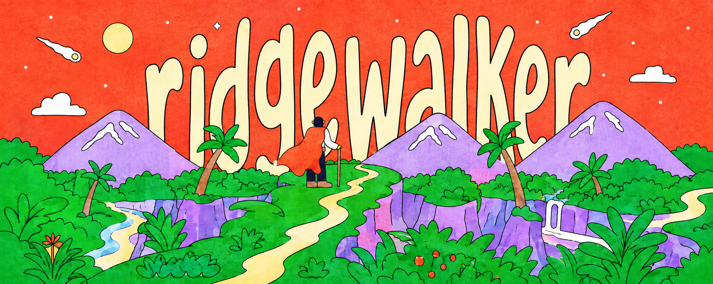

<p align="center">
  
</p>

<p align="center">
  <code>BUILD</code>&nbsp;&nbsp;·&nbsp;&nbsp;<code>RESEARCH</code>&nbsp;&nbsp;·&nbsp;&nbsp;<code>WRITE</code>
</p>

```console
ridgewalker@github:~$ current_focus
building useful things · studying markets · sharing ideas
```

## 01 / ABOUT

我是 **ridgewalker**。

喜欢沿着技术、市场与表达的交界前行，把复杂问题整理成实用的工具、持续的研究和清晰的内容。

## 02 / NOW

- 构建有用的小产品与个人工作流
- 研究 Crypto 与 A 股市场
- 探索 AI 在研究和内容创作中的实际应用

## 03 / SIGNALS

`Product Building` · `AI Tools` · `Market Research` · `Writing`

<sub>Occasionally working with Python, Web and LLM applications.</sub>

## 04 / CONNECT

[1357644645@qq.com](mailto:1357644645@qq.com)

---

<p align="center">
  <sub>Stay curious. Walk the ridge.</sub>
</p>
